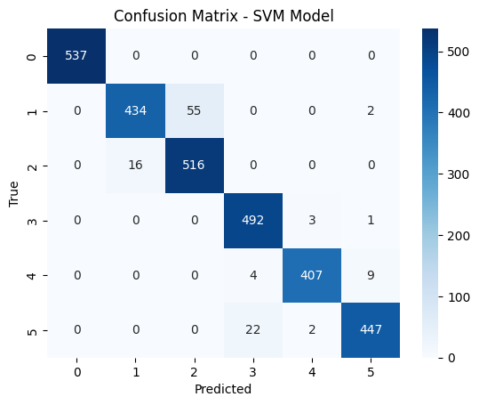

# 🧠 Human Activity Recognition (ML vs DL)

## 📌 Overview
This project compares Machine Learning and Deep Learning models for classifying human activities based on smartphone sensor data.

---

## 🎯 Objective
To evaluate and compare the performance of:
- Machine Learning (Logistic Regression, Random Forest, SVM)
- Deep Learning (Neural Network)

---

## 📊 Dataset
- UCI HAR Dataset : https://www.kaggle.com/datasets/uciml/human-activity-recognition-with-smartphones
- 30 subjects
- 6 activities:
  - Walking
  - Walking Upstairs
  - Walking Downstairs
  - Sitting
  - Standing
  - Laying
- 561 extracted features

---

## ⚙️ Models Used
### Machine Learning
- Logistic Regression
- Random Forest
- SVM

### Deep Learning
- Fully Connected Neural Network (Keras)

---

## 📈 Results

| Model | Accuracy | Macro F1 | Weighted F1 |
|------|--------|----------|------------|
| SVM | 96.1% | 96.1% | 96.1% |
| Neural Network | 93.9% | 93.7% | 93.8% |

---

## 📊 Visualizations

### Model Comparison


### Confusion Matrix (SVM)


### Deep Learning Performance


---

## 🔍 Key Insights
- SVM achieved the best performance across all metrics
- Classical ML outperformed Deep Learning for structured data
- Balanced Macro and Weighted F1 indicates consistent performance across classes
- Model performance depends on data characteristics, not complexity

---

## 🚀 How to Run

```bash
pip install -r requirements.txt
jupyter notebook main.ipynb

